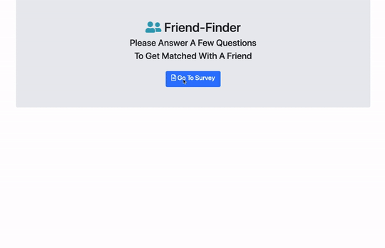
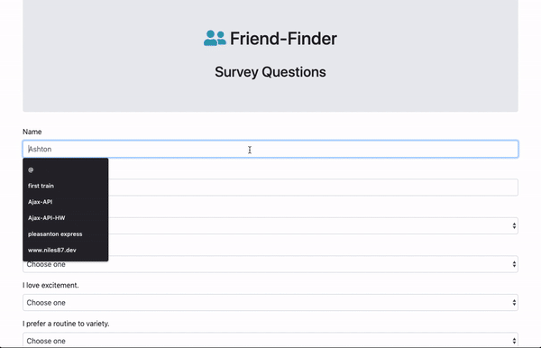
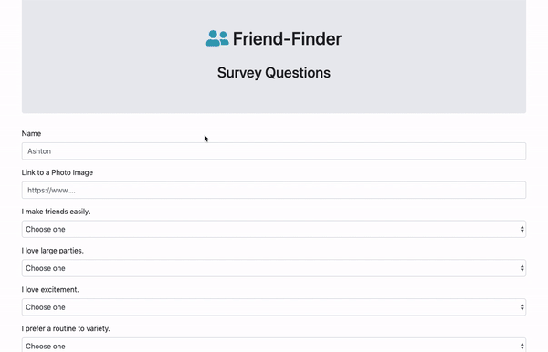

# 
Friend_Finder

## App Visuals

Home Page

Survey

Friends List

## Overview

Friend Finder is a web app that takes user input and matches with a friend using a series of questions to check compatibility.

## How To Use

To use locally clone this repo and in your terminal or command line enter `npm install` or `npm i` to download the files needed to run. After the install enter `node server.js` to start a local server. Go to `localhost:3000` with a browser open to see the home page. Then start click the button to start the survey and see your new friend!

## Technology Used

1. Node.js
2. Express.js
3. Bootstrap
4. Sass

### Contributers

**Niles Bingham** - Full-Stack Developer

[Friend Finder](https://young-plateau-72829.herokuapp.com/ "Heroku Deployed App")
